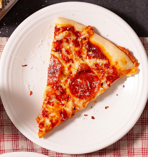
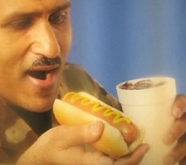

# IKT 524 Food Project
<div style="display:inline;">




</div>

## API
A simple flask application ([api.py](./api.py)) for storing and retrieving food images

``python api.py``

## Worker
[worker.py](./worker.py) Fetches images from the API and processes tem with an AI model

``python worker.py``

## Database
Sqlite3 database. Run the init_db function in [database.py](./database.py) to initialize it

## Models
Python scripts for training the models. 

## Web frontend for testing
```bash
cd frontend
npm install
npm run dev
```

## Extra stuff
See [examples.http](./examples.http) for some http client tests